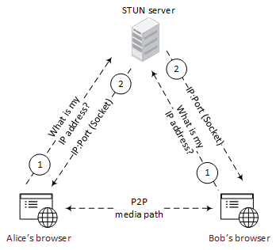
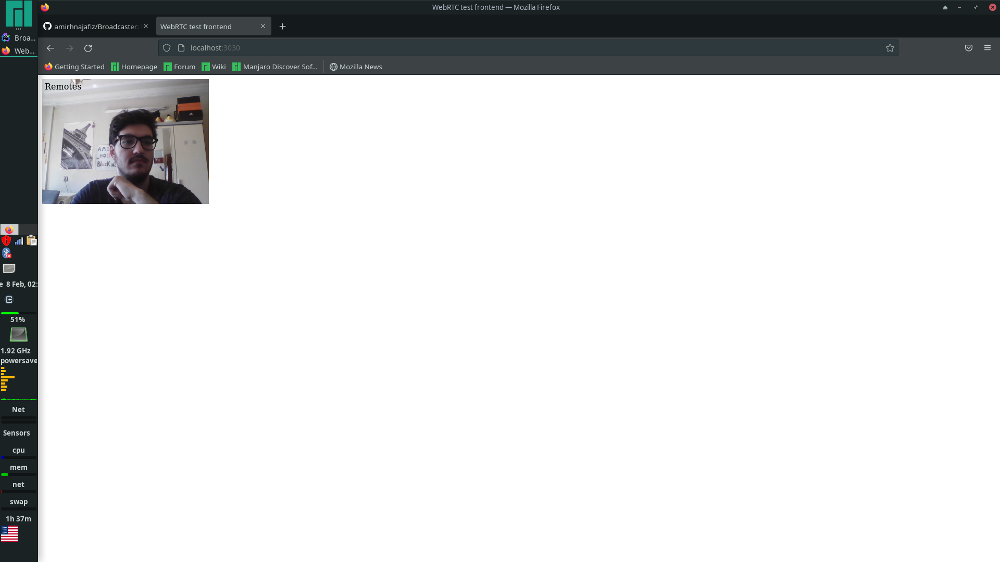

<h1 align="center">
Broadcaster
</h1>

Building a WebRTC video and audio Broadcaster in Golang using ION-SFU, and media devices.
The main idea behind this project is to learn the concepts of Webrtc like 
SDP, ICECandidate, etc.

## What do you learn in this project?
- WebRTC protocol
- STUN server
- ION-SFU
- PION

## What is WebRTC?
WebRTC or **Web Real-Time Communication** is a free open-source project providing 
web browsers and mobile applications with **Real-time Communication** (RTC) and APIs.
It allows audio and video communication to work inside web pages by allowing direct
**Peer-To-Peer** communication, eliminating the need to install plugins or download native
apps.

The technology behind WebRTC are implemented as an open web standard and available
as regular Javascript APIs in all major browsers.

Read more about [WebRTC](https://webrtc.org/).

## What is STUN server?
It is a client-server protocol.

A STUN server is a server that runs on the 
public network and replies to incoming requests. 
The responses it sends out include the public 
IP address the request was sent to him from.

A schema for STUN server:


<p align="center">

</p>

Read more about [STUN Server](https://bloggeek.me/webrtcglossary/stun/#:~:text=A%20STUN%20server%20is%20a,was%20sent%20to%20him%20from.).

## What is ION-SFU?
A selective forwarding unit is a 
video routing service which allows webrtc 
sessions to scale more efficiently. 

This package provides a simple, flexible, 
high performance Go implementation of a WebRTC SFU. 
It can be called directly or through a gRPC or 
json-rpc interface.

Read more about [ION-SFU](https://github.com/pion/ion-sfu).

## What is PION?
The Open Source, Cross Platform Stack for Real-time Media and Data Communication.

In this project we are using **PION / WebRTC**.

Read more about [PION](https://github.com/pion).

## Run the project
### Requirements
Now you need to install the following packages in your system:
- npm
- pkg-config
- libx264 or x264
- libvpx or libvpx-dev
- vaapi 
- libopus or libopus-dev

### Steps
#### Clone
```shell
git clone https://github.com/amirhnajafiz/Broadcaster.git
cd broadcaster
```

#### ION-SFU server
```shell
git clone https://github.com/pion/ion-sfu.git
cd ion-sfu
go build ./cmd/signal/json-rpc/main.go && ./main -c config.toml
```

output:
```shell
[2022-02-08 02:30:40.584] [INFO] [main.go:94] => Config file loaded file=config.toml v=0
[2022-02-08 02:30:40.588] [INFO] [main.go:151] => --- Starting SFU Node --- v=0
[2022-02-08 02:30:40.588] [INFO] [main.go:188] => Started listening addr=http://:7000 v=0
[2022-02-08 02:30:40.589] [INFO] [main.go:130] => Metrics Listening addr=:8100 v=0
```

#### WebRTC server
```shell
cd ..
go run internal/cmd/root.go
```

output:
```shell
2022/02/08 02:35:02 connecting to ws://localhost:7000/ws
[{79584686-6ab6-4e72-b4e2-bcf3cff5bb24 1 pci-0000:00:14.0-usb-0:8:1.0-video-index0;video0 camera} {7e917d25-5db4-451d-82c2-819b2b28e3cf 1 pci-0000:00:14.0-usb-0:8:1.0-video-index1;video1 camera} {082aeb80-85ee-438e-9212-cf9778555fc1 2 616c73615f6f75747075742e7063692d303030305f30305f31662e332e616e616c6f672d73746572656f2e6d6f6e69746f72 microphone} {65ec460f-5188-4895-9e87-69f908bfbfa1 2 616c73615f696e7075742e7063692d303030305f30305f31662e332e616e616c6f672d73746572656f microphone}]
Connection State has changed to checking 
Connection State has changed to connected 
```

### PWA
Now we need to run the client:
```shell
cd client
node server.js
```

output:
```shell
Server is running on port 3030
``` 

Now you can check the application on **localhost:3030** to see something like this:
<p align="center">
    
</p>
